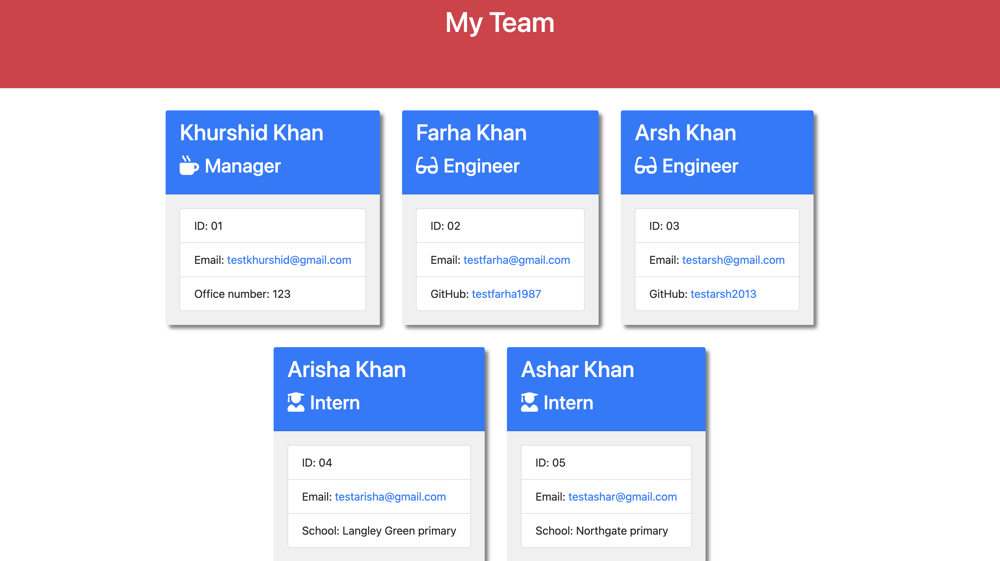
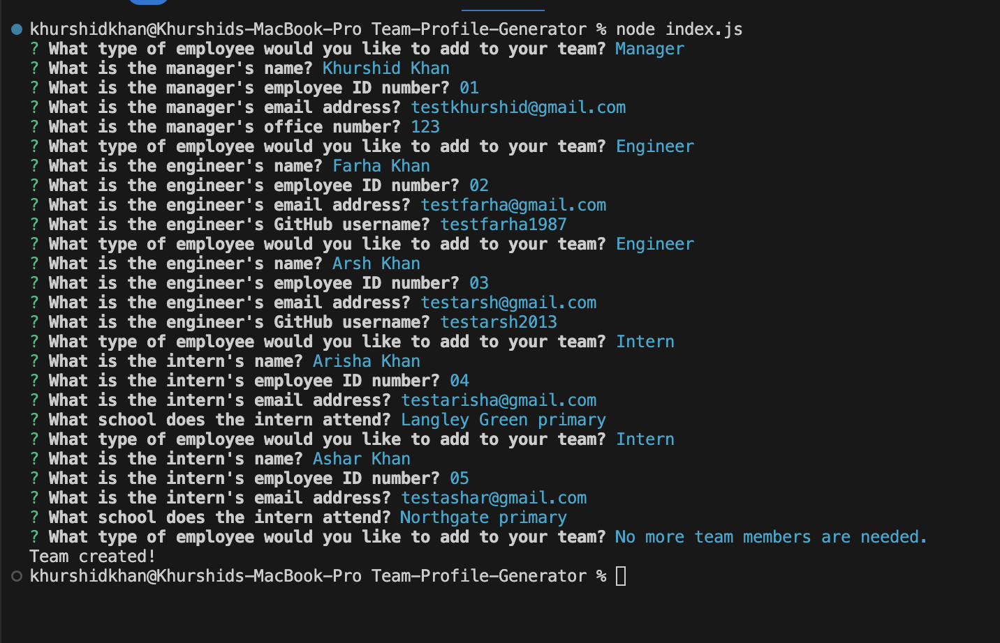
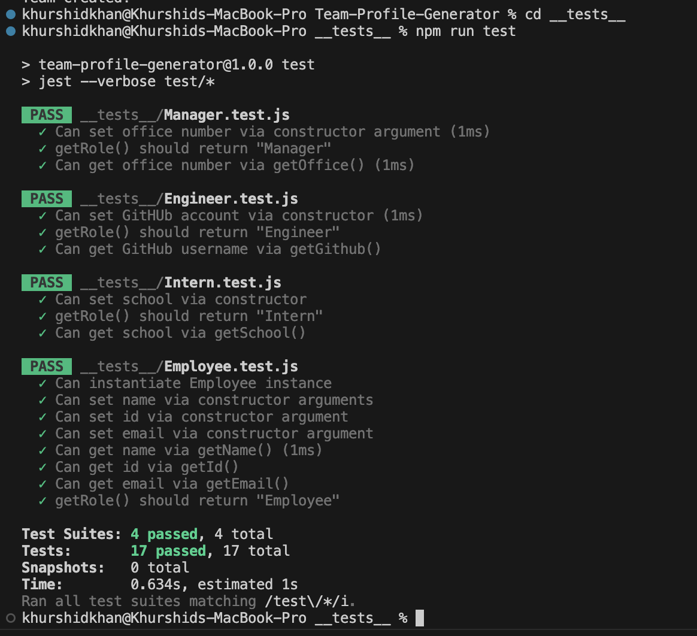

# Test-Driven Development: Team Profile Generator
Challenge 12 : In this Challenge, we'll create an application that generates HTML files using input from a command-line interface.

# Table of Contents:
- [Test-Driven Development: Team Profile Generator](#test-driven-development-team-profile-generator)
- [Table of Contents:](#table-of-contents)
- [User Story](#user-story)
- [Project Requirements](#project-requirements)
- [Project Description](#project-description)
- [Image Links of this Project:](#image-links-of-this-project)
- [Video Link of this Project:](#video-link-of-this-project)
- [Application GitHub URL:](#application-github-url)
- [Application Deployed live URL:](#application-deployed-live-url)

# User Story
  * AS A manager
  * I WANT to generate a webpage that displays my team's basic info
  * SO THAT I have quick access to their emails and GitHub profiles

# Project Requirements
  * Create a command-line application that accepts user input using the provided starter code.
  
  * Create classes for each team member provided and export them. The tests for these classes, which are located in the _tests_ directory, must ALL pass.
  
  * The first class is an Employee parent class with the following properties and methods:
    * name
    * id
    * email
    * getName()
    * getId()
    * getEmail()
    * getRole()—returns 'Employee'
  
  * The other three classes will extend Employee.
  
  * In addition to Employee's properties and methods, Manager will also have the following:
    * officeNumber
    * getRole()—overridden to return 'Manager'

  * In addition to Employee's properties and methods, Engineer will also have the following:
    * github—GitHub username
    * getGithub()
    * getRole()—overridden to return 'Engineer'
  
  * In addition to Employee's properties and methods, Intern will also have the following:
    * school
    * getSchool()
    * getRole()—overridden to return 'Intern'
  
  * Finally, although it’s not a requirement, consider adding validation to ensure that user input is in the proper format.
  
  * Write code in index.js that uses Inquirer to gather information about the development team members and creates objects for each team member using the correct classes as blueprints.
  
  * When a user starts the application, they're prompted to enter the team manager's:
    * Name
    * Employee ID
    * Email address
    * Office number
  
  * When a user enters those requirements, the user is presented with a menu with the option to:
    * Add an engineer
    * Add an intern
    * Finish building the team
  
  * When a user selects the engineer option, the user is prompted to enter the following and then taken back to the menu:
    * Engineer's Name
    * ID
    * Email
    * GitHub username
  
  * When a user selects the intern option, the user is prompted to enter the following and then taken back to the menu:
    * Intern’s name
    * ID
    * Email
    * School
  
  * When a user decides to finish building their team, they exit the application and the HTML is generated.
  
  * Call the render function (provided for you) and pass in an array containing all employee objects.
  
  * The render function will generate and return a block of HTML including templated div elements for each employee.
  
  * Create an HTML file using the HTML returned from the render function.
  
  * Write it to a file named team.html in the output folder.
  
  * You can use the provided variable outputPath to target this location.                 

# Project Description
  * This application will take in information about employees on a software engineering team, then generate an HTML webpage that displays summaries for each person.
  * The focus of this unit was Object Oriented Programming and unit testing.
  * The objective for this project was to build a Node.js command-line application that takes in information about employees on a software engineering team, and with that information generates an HTML webpage that displays the user input data.
  * One requirement of the application was to make use of Constructors and Classes to create the employee objects. Among these were the Employee, Manager, Engineer, and Intern classes.
  * In addition to building the application, this project also required the use of Jest and Inquirer to conduct unit tests of every part of the code to ensure that it would pass each test. A demonstration of the node application and the testing is shown below.
  
# Image Links of this Project:

# Video Link of this Project:

# Application GitHub URL:
[README Generator GitHub Link](https://github.com/khnfarha1987/TDD-Team-Profile-Generator)

# Application Deployed live URL:
[README Generator Deployed Link](https://khnfarha1987.github.io/Readme-Generator-node.js/)
